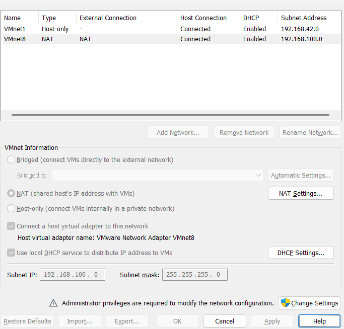

## Phần biệt mạng bride và nat
- Mạng Nat: 
  + Hiểu đơn giản là một router ảo, mạng nội bộ riêng. Khi request đi ra ngoài máy ảo sẽ dùng kỹ thuật Nat để đổi ip nội bộ thành ip trên máy thật. (K chiếm ip của router thật).
  + Máy ảo nhận IP từ DHCP ảo (thường thuộc dải 192.168.x.x hoặc 10.0.x.x khác hoàn toàn dải IP mạng LAN).
  
- Mạng bridge:
  + Máy ảo kết nối trực tiếp vào card mạng vật lý của máy thật. Router thực ngoài đời (như router Wi-Fi) coi máy ảo như một máy tính vật lý độc lập cắm chung dây mạng.
  + Địa chỉ IP: Máy ảo nhận IP trực tiếp từ Router LAN thật (cùng dải IP với máy thật và các thiết bị khác trong nhà, ví dụ 192.168.1.x).
